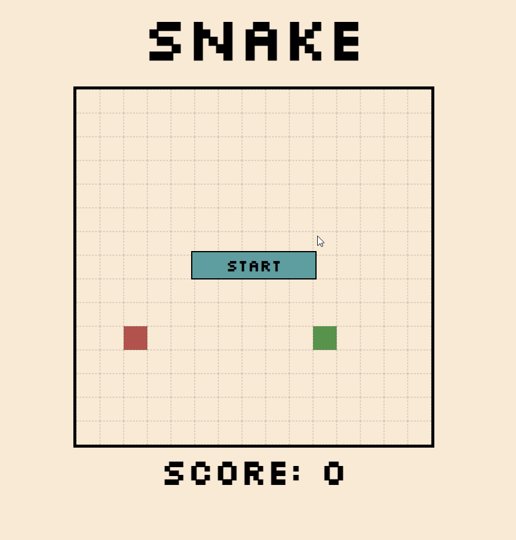

# snake.html

## description

Classic Snake. Open `snake.html` and use the arrow keys :arrow_left: :arrow_up: :arrow_right: :arrow_down: to move!

 

(Hint: you can accelerate.)

**Note:** This was prototyped in Microsoft Edge on a 24" monitor. Your experience may be suboptimal on significantly smaller or larger screens, or (less likely) other browsers.

## background

**HOW:** Plain HTML + CSS + JS. No front-end libraries or game engines. This implementation is simply a dynamic CSS grid.

**WHY:** Practising the basics of web/front-end development. I began an accidental foray into web dev when I found myself in a team of three at the first [Sound of AI hackathon](https://musikalkemist.github.io/thesoundofaihackathon/), building a [browser-based music visualiser](https://github.com/ryanlin/soai) based on the [Cyanite API](https://api-docs.cyanite.ai/). This foray continued by stumbling on (and participating in) the [Boolean Coding Week](https://www.youtube.com/watch?v=zvpwhlvVdwE&list=PLyZlgnMIXPSN-bYZ-TXeazb-jaY6XWfJk), a basic crash course in web development with Tic-Tac-Toe and Space Invaders as live examples. This ended on a Friday; by Saturday evening, I had built Snake.

## to-do

:warning: **Bug alert!** During some play instances, the snake randomly disappears from the grid. This has something to do with a sudden failure to access the `classList` of a cell (or multiple cells) in functions like `eraseSnake`, `drawBlock`, `drawFood`, etc. during runtime. Most instances work fine though—just refresh and restart if something funny happens.

- [ ] Fix bug as mentioned: #000 [Open an issue to link here.]
- [ ] Make CSS layout responsive (resizeable) to accomodate different screen sizes
